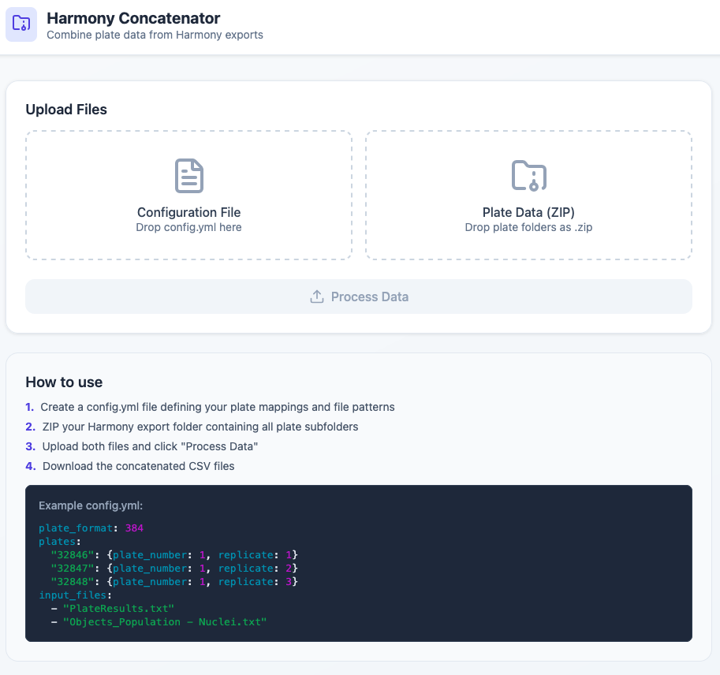

# Harmony Data Concatenator - Web App

A web interface for concatenating Harmony high-content imaging data. Upload your files, click process, download results. No Python or command-line knowledge required.

> **Looking for the command-line version?** See [harmony-data-concatenator](https://github.com/JosephTuersley/revvity_harmony_concatenator) for the Python CLI tool.

## Screenshot



## Features

- **Drag & drop upload** - Simply drag your config and data files
- **Visual feedback** - See processing progress and results
- **Download results** - Get concatenated CSVs as a ZIP file
- **No installation required for users** - Just open in browser
- **Supports all plate formats** - 96, 384, and 1536-well plates

## Choose Your Version

| Version | Best For | Requirements |
|---------|----------|--------------|
| **[Standalone](#standalone-version)** | Quick use, sharing with colleagues | Just a web browser |
| **[Full Web App](#full-web-app)** | Heavy use, very large datasets | Python + Node.js |

---

## Standalone Version

**Zero installation required.** A single HTML file that runs entirely in your browser.

### Quick Start

1. Download `standalone/harmony-concatenator.html`
2. Double-click to open in any modern browser
3. Upload your config.yml and ZIP file
4. Download concatenated results

### Limitations

- File size limit: ~1-2GB (browser memory dependent)
- Slightly slower than server version for very large datasets
- Works offline once loaded

### Sharing

Just email or share the single HTML file - recipients can use it immediately with no setup.

---

## Full Web App

For heavy use or very large datasets (>1GB), run the full client-server version.

### Prerequisites

- Python 3.9+
- Node.js 18+
- conda (recommended)

### 1. Clone the repository

```bash
git clone https://github.com/JosephTuersley/harmony-data-concatenator-web.git
cd harmony-data-concatenator-web
```

### 2. Start the backend

```bash
cd backend
conda create -n harmony_web python=3.9
conda activate harmony_web
conda install fastapi uvicorn pyyaml pandas -c conda-forge
python main.py
```

Backend runs on http://localhost:8000

### 3. Start the frontend

Open a new terminal:

```bash
cd frontend
npm install
npm start
```

Frontend runs on http://localhost:3000

### 4. Open in browser

Navigate to http://localhost:3000

---

## Usage

### Step 1: Create a config.yml file

Define your plate mappings and files to process:

```yaml
plate_format: 384

plates:
  "32846": {plate_number: 1, replicate: 1}
  "32847": {plate_number: 1, replicate: 2}
  "32848": {plate_number: 1, replicate: 3}
  "32849": {plate_number: 2, replicate: 1}
  "32850": {plate_number: 2, replicate: 2}
  "32851": {plate_number: 2, replicate: 3}

input_files:
  - "PlateResults.txt"
  - "Objects_Population - Nuclei.txt"
```

### Step 2: ZIP your Harmony export folder

Your folder structure should look like:

```
MyExperiment/
├── 32846__2025-12-16T13_45_45-Measurement 1/
│   └── Evaluation1/
│       ├── PlateResults.txt
│       └── Objects_Population - Nuclei.txt
├── 32847__2025-12-16T15_29_57-Measurement 1/
│   └── Evaluation1/
│       ├── PlateResults.txt
│       └── Objects_Population - Nuclei.txt
└── ...
```

ZIP this entire folder:

```bash
zip -r MyExperiment.zip MyExperiment/
```

Or right-click → Compress on Mac/Windows.

### Step 3: Upload and process

1. Drag your `config.yml` to the Configuration File box
2. Drag your `MyExperiment.zip` to the Plate Data box
3. Click **Process Data**
4. Wait for processing to complete
5. Click **Download Results**

### Step 4: Check your results

The downloaded ZIP contains concatenated CSV files:

- `concatenated_PlateResults.csv`
- `concatenated_Objects_Population - Nuclei.csv`

## Configuration Reference

### plate_format

Supported values: `96`, `384`, `1536`

### plates

Map each plate barcode to its plate number and replicate:

```yaml
plates:
  "BARCODE": {plate_number: N, replicate: N}
```

- **Barcode**: The number at the start of your folder name (before `__`)
- **plate_number**: Which plate in your experiment (1, 2, 3, ...)
- **replicate**: Which replicate of that plate (typically 1, 2, or 3)

### input_files

List of files to concatenate from each Evaluation folder:

```yaml
input_files:
  - "PlateResults.txt"
  - "Objects_Population - Nuclei.txt"
  - "Objects_Population - Cells.txt"
```

## Output Format

### Added columns

| Column | Description |
|--------|-------------|
| `Plate_ID` | Original plate barcode |
| `Plate_number` | Plate number from config |
| `Replicate` | Replicate number from config |
| `Well_ID` | Standardised well ID (e.g., A01, P24) |

### Column order

```
Plate_ID, Plate_number, Replicate, Row, Column, Well_ID, [original columns...]
```

### Sorting

Data is sorted by `Plate_number`, `Replicate`, then `Well_ID`.

## Project Structure

```
harmony-data-concatenator-web/
├── standalone/
│   └── harmony-concatenator.html  # Zero-install browser version
├── backend/
│   ├── main.py                    # FastAPI server
│   ├── processor.py               # Core processing logic
│   └── requirements.txt           # Python dependencies
├── frontend/
│   ├── src/
│   │   ├── App.js                 # Main React component
│   │   ├── index.js               # Entry point
│   │   └── index.css              # Styles
│   ├── public/
│   └── package.json               # Node dependencies
└── README.md
```

## API Endpoints (Full Web App)

| Endpoint | Method | Description |
|----------|--------|-------------|
| `/api/health` | GET | Health check |
| `/api/process` | POST | Upload and process files |
| `/api/download/{job_id}` | GET | Download results ZIP |
| `/api/cleanup/{job_id}` | DELETE | Clean up temporary files |

## Troubleshooting

### "Barcode not in config" warning

Every plate folder in your ZIP must have its barcode defined in the config. Check that all barcodes are listed.

### ZIP file won't expand / corrupt download

Make sure you're running both backend (port 8000) and frontend (port 3000). The download must go directly to the backend.

### Processing takes a long time

Large datasets (millions of rows) take time. Check the backend terminal for progress logs. For the standalone version, check browser console (F12) for progress.

### "No Evaluation folders found"

Your folder structure may be wrong. Each plate folder must contain an `Evaluation1/` (or similar) subfolder.

### Browser runs out of memory (Standalone)

For very large datasets (>1GB), use the full web app version instead.

## Tech Stack

**Standalone:**
- Pure HTML/CSS/JavaScript
- JSZip (ZIP handling)
- js-yaml (YAML parsing)
- Lucide icons

**Backend:**
- FastAPI
- pandas
- PyYAML
- uvicorn

**Frontend:**
- React 18
- Lucide icons

## Development

### Backend hot reload

```bash
cd backend
uvicorn main:app --reload
```

### Frontend hot reload

```bash
cd frontend
npm start
```

Changes to frontend files automatically refresh the browser.

## Related Projects

- [harmony-data-concatenator](https://github.com/JosephTuersley/revvity_harmony_concatenator) - Command-line version for Python users

## Author

Francis Crick Institute - High Throughput Screening STP

## License

MIT